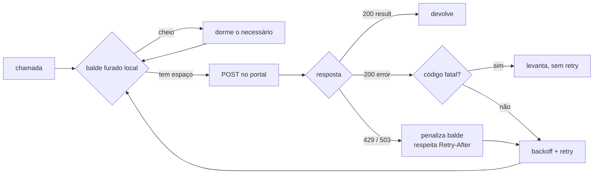

# bitrix24-rest-client

Cliente REST do Bitrix24 para robôs que rodam sozinhos: respeita o limite
antes de estourar, repete só o que vale a pena repetir e nunca duplica um
negócio por causa de um retry.


---

## O problema

Integrar com o Bitrix24 parece trivial: é um `POST` num webhook. O que
derruba RPA em produção não é a chamada — são os quatro comportamentos que
só aparecem depois da centésima requisição:

| Sintoma | Causa real |
|---|---|
| RPA morre às 3h com `KeyError: 'result'` | Portal devolveu **HTTP 200 com `error` no corpo**. `raise_for_status()` não vê. |
| Negócios duplicados depois de instabilidade | Retry de uma escrita que **já tinha gravado** antes do timeout. |
| Sincronização de 80 mil registros leva 6 horas | Paginação por `start` é **quadrática**: cada página reconta o offset. |
| Rajada de `503` no meio da carga | Balde furado do portal cheio. Reagir depois do erro já é tarde. |

Este cliente resolve os quatro.

---

## Como funciona



O ponto central é a seta que volta de `C` para `B`: a espera acontece
**antes** do `POST`. Só reagir ao `503` significa que o robô já gastou a
chamada, já pagou a latência e ainda vai dormir.

---

## Instalação

```bash
pip install -e ".[dev]"
```

Credencial por ambiente — webhook do Bitrix24 é acesso total ao CRM e nunca
entra no repositório:

```bash
cp .env.example .env   # e preencha BITRIX_WEBHOOK
```

---

## Uso

```python
from bitrix24_client import from_env

bx = from_env()
print(bx.whoami()["NAME"])

# Percorre o funil inteiro sem carregar tudo na memória
for deal in bx.fetch_all("crm.deal.list", {"select": ["ID", "TITLE", "OPPORTUNITY"]}):
    print(deal["ID"], deal["TITLE"])

# Grava 500 negócios em 10 requisições em vez de 500
titulos = [f"Negócio {i}" for i in range(500)]
for titulo, novo_id, erro in bx.batch_iter(
    titulos, "crm.deal.add", lambda t: {"fields": {"TITLE": t}}
):
    print(titulo, novo_id or f"FALHOU: {erro}")
```

`batch_iter` devolve **o item junto do resultado**, não só o resultado. É de
propósito: quando um lote falha pela metade, reparear entrada e saída por
índice é o bug mais caro dessa integração — ele grava o dado certo no
registro errado e ninguém percebe até o relatório do mês.

---

## Decisões técnicas

**Balde furado espelhado.** O portal mantém um balde de operações que vaza a
uma taxa fixa. O cliente mantém uma cópia local e espera antes de chamar.
Quando o servidor reclama mesmo assim, `penalize()` enche o balde local pelo
tempo do `Retry-After` — o servidor sempre sabe mais que a estimativa.

**`429` e `503` não são a mesma coisa.** `429` é janela de tempo e vem com
`Retry-After`; `503` é orçamento de operação e vaza sozinho. Tratar os dois
com o mesmo `sleep(60)` desperdiça minutos de janela ou insiste cedo demais.

**Idempotência por hash do payload.** Toda chamada mutante leva um
`Idempotency-Key` derivado de `sha256(método + payload canônico)`. Chamada
repetida com o mesmo conteúdo gera a mesma chave, e o portal devolve o
resultado original em vez de criar um segundo registro.

**Paginação por `>ID`, não por `start`.** Com `order: {ID: ASC}`,
`start: -1` (desliga o `COUNT` implícito) e filtro `>ID` avançando, o custo
por página fica constante. Em 80 mil negócios a diferença medida foi de
horas para minutos.

**Erro fatal não gasta retry.** `expired_token` e `ERROR_METHOD_NOT_FOUND`
levantam na primeira tentativa. Repetir cinco vezes um método que não existe
só atrasa o alerta em 30 segundos.

**Serialização em formato de array PHP.** O endpoint `batch` exige
`fields[TITLE]=x`. A `urlencode` padrão do Python produz
`fields={'TITLE': 'x'}` — e o portal **aceita**, gravando a string literal
no campo. Falha silenciosa, dado corrompido. Por isso `encode_query()` é
próprio e tem teste dedicado.

---

## Testes

```bash
pytest -q
```

28 testes, sem tocar em portal real: `FakeSession` programa as respostas e
um relógio falso adianta o tempo, então a suíte inteira roda em 0,3 s.

Casos cobertos que valem citar: HTML de página de manutenção devolvido com
HTTP 200, lote que falha pela metade, portal que devolve a mesma página para
sempre, e a diferença de envelope entre `crm.deal.list` (lista direta) e
`crm.item.list` (embrulhado em `items`).

---

## Onde este projeto é usado

É a base dos outros robôs da série — importador de leads, vigia de SLA,
carga para BigQuery e o resto. Cada um traz este pacote como dependência em
vez de reescrever tratamento de erro.

## Licença

MIT.
